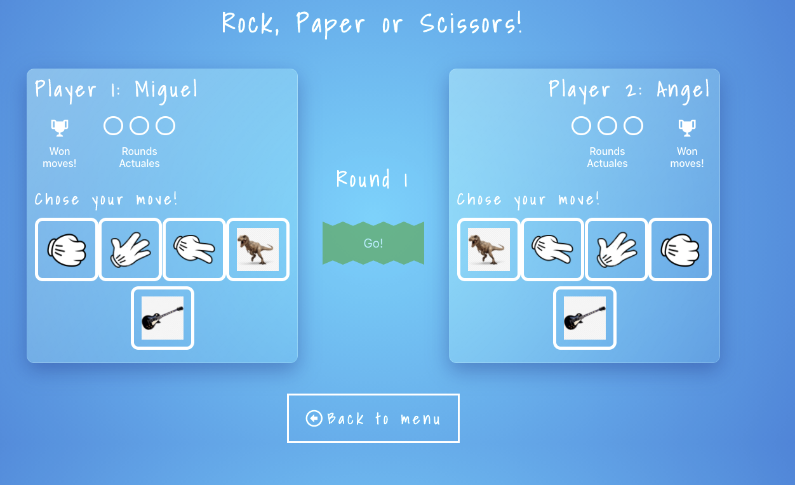

**This is the front of the Game made in React and Redux**

Once you download this project, you just to run these command lines.

to install node_modules
- npm install

And then to run the front
- npm start

This is what it looks like

 

This is how statistics looks like

 

And for the last, of course you can change to dark mode

 

and this is how it looks like

 

Enjoy. :smirk:
